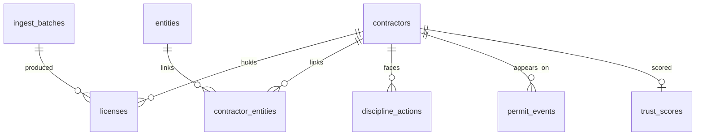

# Schema notes

Logical model lives in [`schema/initial_schema.sql`](../schema/initial_schema.sql).

## Core entities

| Table | Purpose |
|-------|---------|
| `contractors` | Canonical person/business shell (display name, state home) |
| `licenses` | Board-issued credentials (FL DBPR, later NJ DCA, …) |
| `entities` | Corporate shells (Sunbiz) + DBPR Qualifying Business shells |
| `contractor_entities` | Many-to-many link with role (qualifier, officer, DBA, QB) |
| `discipline_actions` | Board / ULA / recovery-fund rows (`discipline_events` view alias) |
| `permit_events` | Local permit activity (later) |
| `trust_scores` | Transparent component scores + explanation JSON |
| `ingest_batches` | Provenance for every load (`ingest_runs` view alias) |

See [LOAD_PATH.md](LOAD_PATH.md) for the FL DBPR → Postgres loader.

## Florida keying

- `licenses.external_key` = full license id when available (`CBC015082`)
- `licenses.license_number` = numeric core from board file
- `licenses.occupation_code` = `CBC`, `CGC`, `QB`, …
- `licenses.source_system` = `fl_dbpr`

## Trust score principles (Phase 0 stub)

Scores are **not** magic. Components must map to stored evidence:

- License currency (status + expiration)
- Discipline severity / recency
- Entity good standing (when linked)
- Permit activity (optional, later)

UI must show source lines for each component. No black-box overall grade without breakdown.
